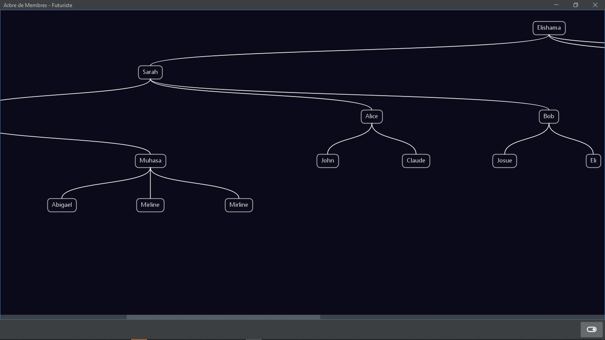
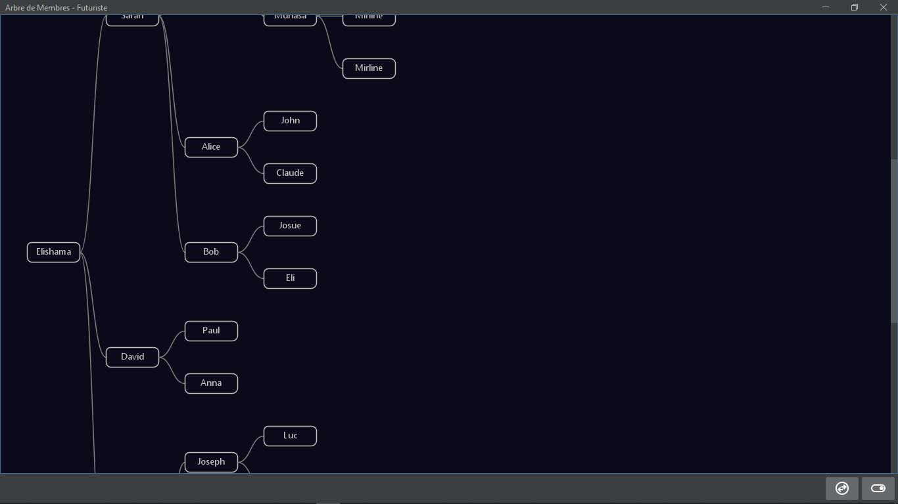

# Member Tree Library

**Member Tree Library** est une bibliothèque Java Swing en architecture MVC permettant de représenter et manipuler un arbre ternaire de membres (chaque membre peut avoir jusqu’à trois enfants). Elle intègre une interface graphique moderne avec support du thème sombre, une navigation interactive dans l’arbre, et la gestion dynamique des membres.

## ✨ Fonctionnalités

- Arbre de membres de structure ternaire (max 3 enfants par membre)
- Interface graphique en Java Swing avec thème sombre
- Navigation intuitive (double-clic pour explorer un sous-arbre)
- Chargement dynamique des enfants à partir du contrôleur
- Support des icônes SVG via `svgSalamander`
- Architecture MVC claire et modulaire
- Intégration avec `SwingX`, `FlatLaf`, et `svgSalamander`

## 📦 Installation

Ajoutez la dépendance à votre projet Maven :

```xml
<dependency>
    <groupId>com.arbre</groupId>
    <artifactId>member-tree-library</artifactId>
    <version>1.0.0</version>
</dependency> 
```
---
⚠️ Assurez-vous d'utiliser Java 16 ou supérieur (comme défini dans le pom.xml).

## 🚀 Démarrage rapide
1. Instanciez un contrôleur :
```java
MemberController controller = new MemberController();
```
2. Ajoutez des membres(ex) :
```java
Member root = controller.getRootMember();
controller.createMember("Alice", root);
controller.createMember("Bob", root);
```
3. Affichez la vue :
```java
JFrame frame = new JFrame("Arbre de membres");
MemberTreeView treeView = new MemberTreeView(controller);
treeView.setRootMember(root);

frame.setDefaultCloseOperation(JFrame.EXIT_ON_CLOSE);
frame.setSize(800, 600);
frame.setContentPane(new JScrollPane(treeView));
frame.setVisible(true);
```
---
## 📁 Structure du projet
- com.arbre.model : Définition des membres
- com.arbre.controller : Logique métier et gestion de l’arbre
- com.arbre.calculator : Logique pour le calcul de la disposition de l'arbre
- com.arbre.view : Composant graphique Swing pour afficher l’arbre
- com.arbre.util : Outils utilitaires, notamment pour les icônes SVG

## 🧪 Exécuter le projet
Utilisez la commande suivante pour lancer l'application depuis Maven :

```brach
mvn clean compile exec:java
```
## 🧩 Dépendances
- SwingX 1.6.1 : composants Swing avancés
- FlatLaf 2.0 : thème moderne et sombre
- svgSalamander 1.1.4 : affichage d’icônes SVG

## 📸 Aperçu




## 🔧 Personnalisation
- Le composant MemberTreeView peut être intégré dans n'importe quelle interface Swing
- Possibilité d’activer/désactiver le thème sombre en modifiant darkMode dans MemberTreeView
- Ajoutez des interactions via les événements souris (ex: clic droit pour menu contextuel)

## 📝 Licence
Ce projet est sous licence MIT. Voir le fichier LICENSE pour plus de détails.

## 📬 Contact
Développé par ELISHAMA VAYANZA
Email : [vayanzaelishama@gmail.com]
Projet : Member Tree Library

Ce projet est conçu pour une utilisation pédagogique, professionnelle ou pour tout système de parrainage, réseau binaire/ternaire, ou gestion hiérarchique visuelle.